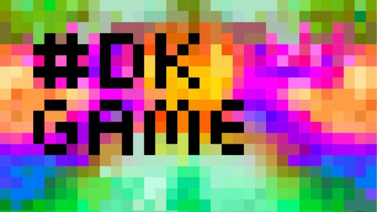

# DKGameWorkshop

This Github-repo holds materials for the workshop held at Born-Digital Collections, Archives and Memory conference 2025. The center of the workshop is the Royal Danish Library's  collection of video games colledted under the legal deposit act. The workshop focus is on the work of collecting, preserving and making the video games accessable. The workshop also includes a practical code based data processing exercise working on the registry of the collected games. During this attendees will extract trends and development in platforms, publishers and titles of 30 years of Danish video games. 

All data processing is done in R using the [tidyverse-packages](https://www.tidyverse.org) 
